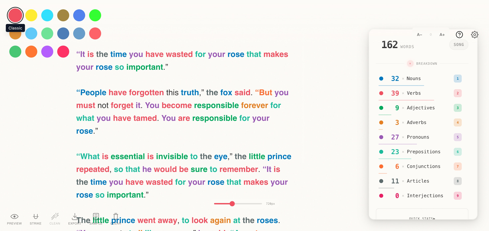
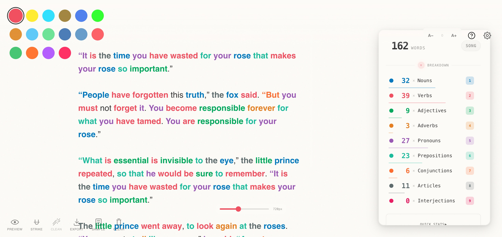
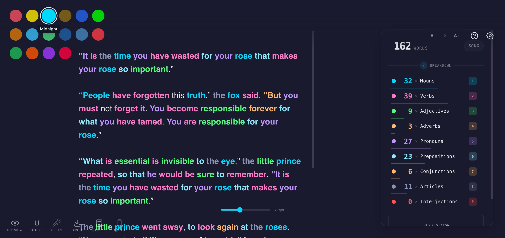
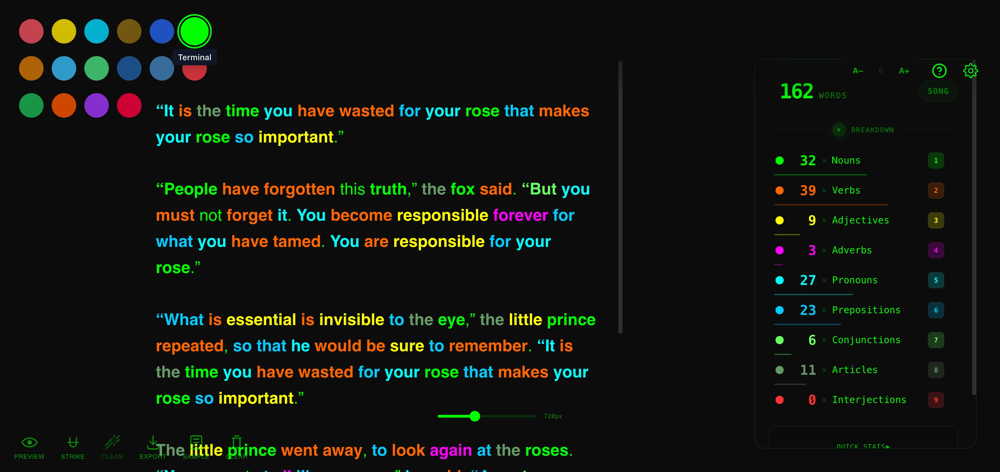
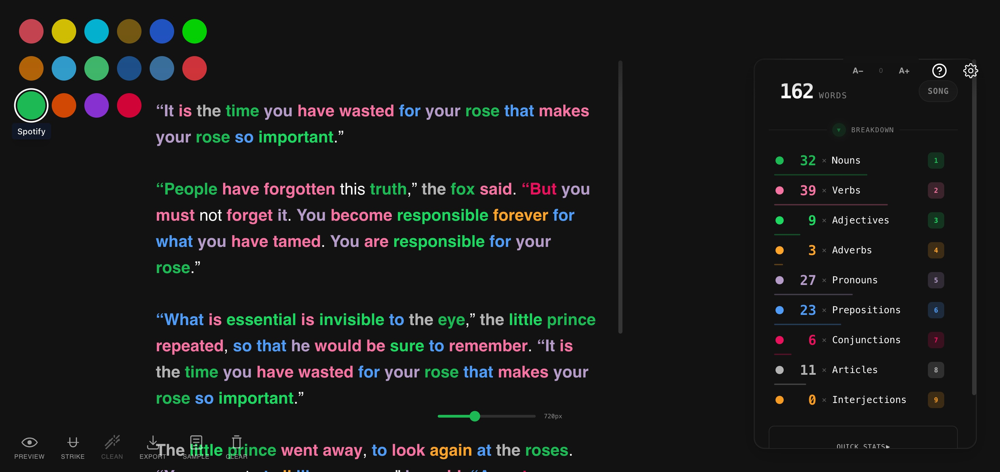
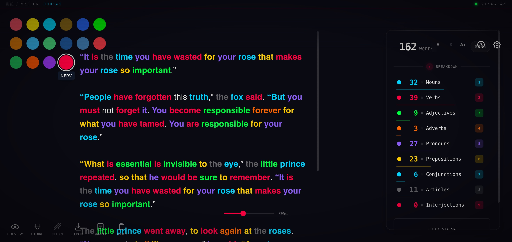
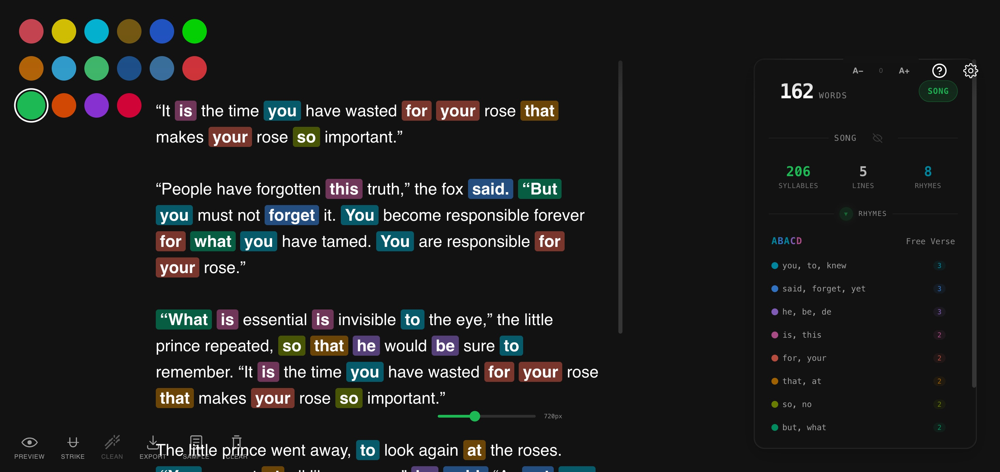
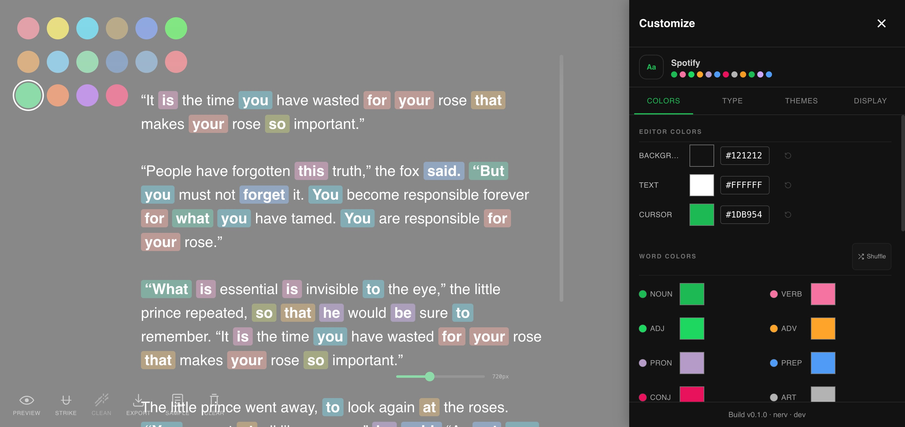
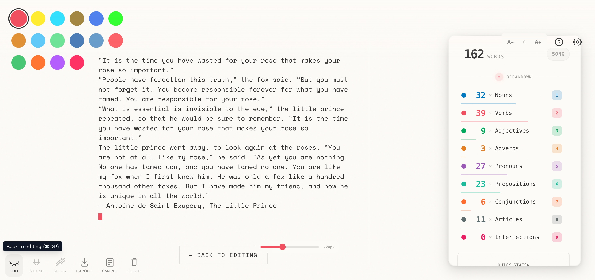

<div align="center">

# Clean Writer (Ruby Version)

### Distraction-free writing with real-time syntax highlighting

[]()
[]()
[]()
[]()

[Live Demo](https://clean-writer-ruby-version.fly.dev/)

</div>

---

> 16 themes, song mode with rhyme detection — rebuilt in Rails 8 + React 19 with server persistence.



## What Is This

A 1:1 reimplementation of [clean-writer](https://github.com/stussysenik/clean-writer) adding a Rails backend for persistence, real-time sync, and deployment. Everything the original does — but backed by PostgreSQL instead of localStorage.

| | clean-writer | clean-writer-ruby-version |
|---|---|---|
| Storage | localStorage (one browser) | PostgreSQL (any device) |
| Multi-tab | Conflicts / overwrites | ActionCable real-time sync |
| Themes | Hardcoded JSON | Database-backed, customizable |
| Settings | localStorage | Server-persisted per session |
| Offline | Always works | IndexedDB queue with replay |
| Deploy | Static hosting | Fly.io / any Docker host |

---

## Product Demo

### Writing Editor

The core experience is a distraction-free typewriter with real-time part-of-speech highlighting. Every word is color-coded by grammatical role (nouns, verbs, adjectives, etc.) as you type, powered by [compromise NLP](https://github.com/spencermountain/compromise) running in a Web Worker.



The right panel shows a live word count and part-of-speech breakdown. Toggle any category with keyboard shortcuts `1`-`9` to dim or highlight specific word types.

### 16 Theme Presets

One-click theme switching from the color dot bar. Themes range from light (Classic, Paper, Sepia) to dark (Midnight, Terminal, NERV) to music-inspired (Spotify, Apple Music, SoundCloud, Deezer).

| | |
|---|---|
|  |  |
| **Midnight** — deep blue dark theme | **Terminal** — green-on-black hacker aesthetic |
|  |  |
| **Spotify** — dark with green accents | **NERV** — Evangelion tech-art with CRT overlay |

### Song Mode

Toggle **SONG** in the sidebar to activate rhyme detection powered by the CMU Pronouncing Dictionary. The panel shows syllable count, line count, detected rhyme scheme (ABACD, AABB, etc.), and rhyme group pairs — all color-coded with highlighting in the editor.



### Theme Customizer

Click **Customize Theme** to open a full color editor. Override background, text, cursor, and all 9 word-type colors per theme. Shuffle generates random harmonious palettes. Save as a custom theme or reset to presets.



### Markdown Preview

Toggle preview mode from the toolbar to see rendered markdown output with proper formatting.



### More Features

- **Adjustable line width** — drag the slider (300–1400px) for your preferred column width
- **Font size controls** — increase/decrease/reset from the top bar
- **Strikethrough mode** — select text and strike it, then bulk-remove all struck segments
- **Export** — download your document as a `.md` file
- **Auto-save** — content persists to server on every keystroke (debounced)
- **Keyboard shortcuts** — `?` opens the full shortcut reference

---

## The NERV Theme

The 16th theme is a full **Neon Genesis Evangelion** tech-art aesthetic:

- Animated boot sequence (MAGI system initialization, AT Field status)
- CRT scanline overlay with phosphor glow
- Glitch effects and terminal-style status bar
- EVA Unit-01 color palette (purple/green/orange on black)

The NERV components live in `frontend/components/nerv/` and activate only when the NERV theme is selected.

---

## Architecture

```
Browser                              Server
┌──────────────────────────┐        ┌──────────────────────────┐
│  React 19 + TypeScript   │  REST  │  Rails 8.1 API (v1)      │
│  ├─ Typewriter editor    │◄──────►│  ├─ Documents (autosave)  │
│  ├─ NLP syntax highlight │  API   │  ├─ Themes (presets)      │
│  ├─ Song mode + rhymes   │        │  ├─ Settings (per-session)│
│  ├─ 16 themes + customizer│ WS   │  ├─ Export (markdown)     │
│  └─ GSAP animations     │◄──────►│  └─ ActionCable (sync)    │
└──────────────────────────┘        └────────────┬─────────────┘
                                                 │
                                    ┌────────────┴─────────────┐
                                    │  PostgreSQL               │
                                    │  Solid Cache/Queue/Cable  │
                                    └──────────────────────────┘
```

## Tech Stack

| Layer | Technology |
|-------|-----------|
| Backend | Rails 8.1, Ruby 4.0.1 |
| Frontend | React 19, TypeScript 5.8 |
| Build | Vite 6.4, vite_rails |
| Database | PostgreSQL |
| Real-time | ActionCable (Solid Cable) |
| Background Jobs | Solid Queue (in-Puma) |
| Caching | Solid Cache |
| Styling | Tailwind CSS 4 |
| Animation | GSAP 3.14 |
| NLP | compromise 14 (Web Worker) |
| Rhyme Detection | CMU Pronouncing Dictionary |
| Drag & Drop | dnd-kit |
| Markdown | react-markdown + remark-gfm |
| HTTP Proxy | Thruster |
| Deployment | Fly.io (Docker) |

---

## Setup

### Prerequisites

- Ruby 4.0.1
- Node.js 22+
- PostgreSQL 14+

### Install

```bash
git clone https://github.com/stussysenik/clean-writer-ruby-version.git
cd clean-writer-ruby-version
bundle install
npm install
```

### Database

```bash
bin/rails db:create db:migrate
bin/rails db:seed    # seeds 16 preset themes
```

### Run

```bash
bin/dev
```

Starts Rails (port 3000) + Vite dev server via `Procfile.dev`. Open [http://localhost:3000](http://localhost:3000).

---

## Deployment (Fly.io)

### First-time setup

```bash
fly auth login
fly apps create clean-writer-ruby-version
fly postgres create --name clean-writer-ruby-db --region iad
fly postgres attach clean-writer-ruby-db --app clean-writer-ruby-version
fly secrets set RAILS_MASTER_KEY=$(cat config/master.key) --app clean-writer-ruby-version
```

### Deploy

```bash
fly deploy
```

### Seed themes (one-time)

```bash
fly ssh console -C "/rails/bin/rails db:seed"
```

### Cost

| Resource | Spec | Monthly |
|----------|------|---------|
| Web machine | shared-cpu-1x, 512MB | ~$3.32 |
| Postgres | shared-cpu-1x, 256MB, 1GB | ~$2.17 |
| **Total** | | **~$5.49** |

Auto-stop machines reduce cost when idle.

---

## Models

| Model | Purpose |
|-------|---------|
| **Document** | Content, word count, view mode, font settings, highlight config |
| **Theme** | 16 presets + custom themes with full color customization |
| **ThemeOverride** | Per-session color overrides for any theme |
| **UserSetting** | Active theme, theme order, visibility, rhyme settings |

## License

MIT
